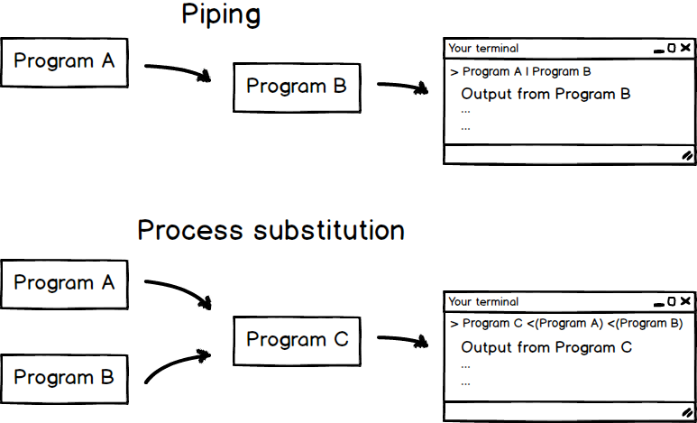

Pipes, process substitution and why should a biologist ever care
----------------------------------------------------------------

A lot of the computational work that a modern genetically inclined biologist has to do is actually just converting data between incompatible formats and other trivial processing tasks - think converting *fastq* to *fasta*, trimming off adapter sequences, removing problematic characters from *fasta* ids etc... A lot of labs have their stash of Perl and Python scribbles to handle these tasks and certainly these scripts do their thing. However, I personally prefer doing as much of this as possible using just the plain Unix command line and avoid writing scripts if possible. The brevity of expression that Unix command line provides for simple text and sequence processing tasks is about unparalleled. Plus the commands are available on any Unix system, right out of the box.

What's the deal with pipes?
---------------------------

Unix command line and standard tools were not designed for DNA sequence processing but nevertheless [do that really well](https://github.com/stephenturner/oneliners). The basic Unix commands form a vocabulary of simple text and sequence processing operations and this vocabulary can be combined into sentences using Unix pipes. For a better introduction for pipes than I can provide here, [this video tutorial](https://www.youtube.com/watch?v=9gSPo-9mLOs) will get you started. Piping is an easy but powerful concept and definitely worth learning. Here are three common commands in the Unix text and sequence processing vocabulary:

-   **cat** prints contents of a file on screen or sends them down a pipe
-   **rev** reverses any line of text
-   **tr** replaces a set of characters with a different set of characters

Let's put some of these into practice. A simple example would be taking reverse-complements of DNA sequences in file *sequences.txt* (which you can download [here](https://raw.githubusercontent.com/manutamminen/teaching_materials/master/sequences.txt)):

sequences.txt 

```bash
AAGTGTCGTA 
GGTCGCAAATG
GAAGTGCCTAG 
TGAAGATGC
```

A very simple command pipeline to do the
task would be 

```bash
cat sequences.txt | rev | tr AGCT TCGA
```

This crunches through the file *sequences.txt*, first
reversing each sequence and then converting each into a respective
complement, line by line. The output is - not surprisingly - a
reverse-complement of each sequence: 

```bash
TACGACACTT
CATTTGCGACC
CTAGGCACTTC
GCATCTTCA
```

A trick I use all the time is a minor variant of this: during primer design I reverse-complement sequences a lot and want to do that with a minimal typing effort. In that case I won't even bother to create a file; rather I just send a text string to **rev** and **tr** using command **echo** and the following pipeline. [^alias]

```bash
echo TGGTAGTGTAACGCCTACA | rev | tr AGCT TCGA
```

Pipes can be used to join pretty much any Unix commands together. After all my years with Unix, I'm still discovering new useful ways of piping stuff together.

When are pipes not enough?
--------------------------

Pipes are great but not always enough. A good example is a more realistic case of reverse-complementing sequences: in real world DNA sequences are typically not provided as simple lists. Rather, a typical format would be *fasta* where the sequence ids are interspersed by the DNA sequences, as shown in the example below:

example.fasta 

```bash
>Sequence_id_1 
AATTGATAGGTCCGTT
>Sequence_id_2
TTGTCGTTATATGGTTAC
>Sequence_id_3
GTTGAGTCGTGGTCGT
```

With the kind of command pipeline we used above, the sequence ids would also get reversed and their letter As translated into Ts etc... How could we get around this? I first read about process substitution in this [excellent blog entry](http://www.vincebuffalo.com/2013/08/08/the-mighty-named-pipe.html). Don't be put off by a scary name - the concept is about as simple as Unix pipes and about as useful. Where piping directs the output of one command to the input of next one, process substitution directs outputs of multiple commands to the input of next one. The figure below attempts to illuminate the concepts and their difference.



Let me demonstrate this using an example. To reverse-complement every sequence in a multiple *fasta* file and leave the sequence ids untouched, one has to separate the id and sequence parts. For this we also have to introduce two new words into our text processing vocabulary:

-   **paste** joins together two lines of text
-   **grep** finds lines containing (or excluding) a particular text string or character

```bash
paste -d "\n" <(grep ">" sequence.fasta) <(grep -v ">" sequence.fasta | rev | tr ATCG TAGC)
```

That's it[^fasta] - one line of text and quite readable if you get used to the process substitution notation. Let's open this up a little: after the **paste** command there are two text strings enclosed inside a `<( ... )` -structure. This structure is used to create a stream of text. Since we're having two of those structures after **paste**, we're directing two separate text streams to the paste command. **Paste** takes these text streams and intersperses their lines. The first text stream is the fasta headers - no processing is taking place for those.

```bash
grep ">" sequence.fasta
```

The second text stream is the sequence parts of the fasta file (filtered by **grep** using the `-v` switch) that are, before streaming out to **paste**, streamed through **rev** and **tr** to take a reverse-complement of each sequence.

```bash
grep -v ">" sequence.fasta | rev | tr AGCT TCGA
```

The `-d "\n"` switch instructs **paste** to use a newline character as a separator for the text streams. See for yourself what happens if you leave that out! The output of our command pipeline currently gets printed on screen where we can inspect it and see that it's good. However, we typically want to save the output on disk for subsequent use. There's a very easy way to redirect the text output from screen to a file - that is the redirection operator `>`. Just append your command pipeline with character `>` and the file name, and there you have it. The example below saves the reverse-complemented sequences into a new file called *reverse_complemented_sequences.fasta*.

```bash
paste -d "\n" <(grep ">" sequence.fasta) <(grep -v ">" sequence.fasta | rev | tr ATCG TAGC) > reverse_complemented_sequences.fasta
```

In this example we only
modified the sequence part by taking a reverse-complement. Basically one
could do many other modifications to both the sequence and id parts, or
convert the file into some entirely different format. There are other
standard Unix tools that provide more neat text manipulation tricks and
what I find especially useful is a little programming language called
Awk. But that's another story!
